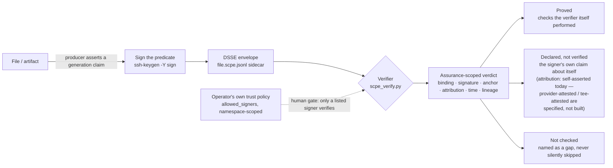

<p align="center"></p>

# SCPE — Signed Content Provenance Evidence

[](https://github.com/augbastos/scpe/actions/workflows/ci.yml)
[](https://pypi.org/project/scpe-protocol/)
[](pyproject.toml)
[](LICENSE)

**A signed, checkable claim about what produced a file — and a verifier that tells you
exactly what it checked and what it did not.**

## Why it exists

Most of what a "provenance envelope for AI artifacts" would add is already shipped.
`c2pa-rs` 0.26.46 (8 April 2026) made sidecar signing format-agnostic — *"Allow any file
type to be signed with a sidecar"* (PR #2014) — in-toto has bound subjects purely by
digest since v1, OpenSSF Model Signing v1.0 ships a detached, offline-verifiable sidecar
for AI artifacts today, and `gh attestation verify --bundle --custom-trusted-root` does
air-gapped verification as a shipped feature. Two seams survive that survey. The
in-toto/SLSA/Sigstore supply-chain stack has no predicate for *"model M, version V,
provider P produced these bytes"* — C2PA has one, `c2pa.ai-disclosure`, but it sits
behind a certificate gate, and as of the survey date 166 of 174 certified products were
still on spec 2.2, with exactly one declaring ML formats. And no verifier in the field
renders what a signature actually established as separate, named facets — the ordinary
case, *"identity X signed a claim that model M made these bytes, and M signed
nothing,"* goes unstated everywhere else. SCPE is a vocabulary for the first gap and a
verification-honesty layer for the second — not a cryptographic contribution.
Primary-source survey, dated 31 August 2026:
[docs/standards-landscape.md](docs/standards-landscape.md).

```console
$ python reference/scpe_verify.py report.pdf --policy ~/.ssh/allowed_signers
[OK] ok

  What this result is:
    binding      bound
    signature    valid
    anchor       policy
    attribution  self-asserted  - the producer signed a claim about itself; nothing independent corroborates it
    time         unanchored
    lineage      declared

  Proved (checks this verifier performed):
    + subject digest matches the supplied bytes (sha256)
    + signature over the predicate by SHA256:Y6GIsYhCeRNdFc9wzAD/K4mv8FvFoQiG/ZvV3WOiGKc (principal alice, role-scoped namespace)
    + the signing key is listed in the operator's allowed_signers file

  Declared by the signer (NOT verified):
    ~ generation.digitalSourceType = http://c2pa.org/digitalsourcetype/trainedAlgorithmicData
    ~ generation.provider = anthropic
    ~ generation.model = claude-opus-4-5-20251101
    ~ generation.humanOversight = prompt_guided
    ~ subject[0].name = report.pdf
    ~ subject[0].mediaType = application/pdf
    ~ derivedFrom: inputTo quarterly.csv

  Not checked:
    ? that claude-opus-4-5-20251101 produced these bytes - the claim is signed by the producer about itself, and no provider or TEE attestation is present
    ? when this was signed - no verified time anchor is present
    ? that any derivation edge occurred - no parent statement was resolved
    ? that no other transformation occurred - SCPE cannot express that claim
```

*(Real output, pasted unedited. There is no `scpe verify` console script for this format —
the published `scpe` entry point still belongs to the retired `scpe/0.1` CLI.)*

**That last block is the product.** Most tools in this space answer with a verdict. This one
answers with the scope of the verdict.

---

## How it works



The signature is what binds the predicate to a signer (**B → C**). The human gate is the
**operator's own trust policy** — the `allowed_signers` file (format shown under
[Install and use](#install-and-use)), held offline, with no infrastructure: nothing
verifies for a key that isn't listed in it (**P → D**). There is no GitHub identity
binding and no repo-owner merge gate in this flow — that was `scpe/0.1`'s pull-request
model, retired; see [docs/README-scpe-0.1-archived.md](docs/README-scpe-0.1-archived.md).
What comes out (**E**) is never collapsed into one verdict — see
[Six facets, not one verdict](#six-facets-not-one-verdict) below.

## What this is

SCPE is an [in-toto](https://github.com/in-toto/attestation) predicate type carried in a
[DSSE](https://github.com/secure-systems-lab/dsse) envelope, stored as a detached
`file.scpe.jsonl` sidecar, plus a single-file standard-library verifier.

It writes **no cryptography, no envelope, no canonicalization, no transparency log, no PKI,
and no AI-origin vocabulary.** All of that already exists and is better maintained elsewhere.
What SCPE adds is four things:

1. **A generation predicate** — *which model, at which version, from which provider, produced
   these bytes* — for the **in-toto/DSSE supply-chain stack**, which has no such predicate.
   C2PA 2.4 does say this, in `c2pa.ai-disclosure`, and says it well; it says it inside JUMBF,
   behind a certificate gate, in an ecosystem where 166 of 174 certified products are still on
   spec 2.2 and exactly one declares ML formats.
2. **Typed derivation edges** over arbitrary bytes, reusing C2PA's `parentOf` /
   `componentOf` / `inputTo` rather than minting a fourth vocabulary.
3. **Sidecar discovery** for a loose file — the convention in-toto never specified.
4. **An assurance model** that reports what a signature established as separate, computed
   facets — and never collapses them into a score, a grade, or a green tick.

SCPE is not an AI detector: every record is the signer's own assertion, and its truth
rests on the signer's honesty, not on anything SCPE inspects in the bytes. And because
in-toto attestations are monotonic — they only add — SCPE cannot express "this file is
not AI-generated"; that claim is structurally out of reach, not merely unimplemented.

## Six facets, not one verdict

A result is never collapsed into a single verdict. It is six independently computed
facets — `binding`, `signature`, `anchor`, `attribution`, `time`, `lineage` — and each
one is reported as:

- **Proved** — a check the verifier itself performed and can point to.
- **Declared** — the signer's own claim about itself, carried but not independently
  checked.
- **Not checked** — named as a gap in the result, never silently skipped.

That is what the example above is showing: a signature can be `proved` valid while the
claim it carries — which model, which provider — stays `declared`, because nothing here
independently corroborates *that*. Splitting the two, instead of blending them into one
green tick, is the verifier's whole product.

---

## Install and use

Requires Python 3.11+ and `ssh-keygen`. Nothing else — the verifier is one standard-library
file.

```console
# sign a file with a key you already have
$ python reference/scpe_sign.py report.pdf --key ~/.ssh/id_ed25519 \
      --provider anthropic --model claude-opus-4-5-20251101 \
      --source-type trainedAlgorithmicData --oversight prompt_guided
report.pdf.scpe.jsonl

# verify against a trust policy you control
$ python reference/scpe_verify.py report.pdf --policy ~/.ssh/allowed_signers
$ python reference/scpe_verify.py report.pdf --policy ~/.ssh/allowed_signers --json
```

The trust policy is OpenSSH's own `allowed_signers` format, used verbatim:

```
alice namespaces="scpe/1"     ssh-ed25519 AAAA…
bob   namespaces="scpe-obs/1" ssh-ed25519 AAAA…
```

That `namespaces=` restriction is enforced by OpenSSH itself at verification time, so a key
bound to `scpe/1` **verifies** as a producer and will not verify as an observer. Role separation is expressible in a
text file the operator owns, offline, with no infrastructure.

### Recording what a file came from

```console
$ python reference/scpe_sign.py final.txt --key ~/.ssh/id_ed25519 \
      --derived-from draft.txt:parentOf \
      --derived-from quarterly.csv:inputTo
```

A `parentOf` edge is pinned to the parent's signed statement, not merely to the parent file —
so someone who publishes their own record about the same input cannot silently become your
ancestor. The tool refuses to declare a `parentOf` edge to a file that has no record, because
that pin is not optional.

### Committing to a prompt without storing it

```console
$ python reference/scpe_sign.py report.pdf --key ~/.ssh/id_ed25519 \
      --commit-prompt ./prompt.txt
```

Prompts contain intellectual property, confidential material and personal data. **SCPE never
requires storing one.** A commitment records a salted, structurally framed hash (SD-JWT
disclosure form) — the prompt text never enters the record. The disclosure needed to open it
later is written beside you, to `report.pdf.scpe.disclosures.jsonl`, and **is never
published**: without it the commitment can never be opened, by anyone, including you.

---

## Exit codes

| Code | Status | Meaning |
|---|---|---|
| 0 | `ok` | Everything checked, checked out. |
| 10 | `ok-self-anchored` | Valid — but the trust anchor came from inside the input. |
| 11 | `subject-unavailable` | Record is valid; the artifact bytes were never supplied. |
| 20 | `signature-invalid` | A declared signature failed. |
| 21 | `digest-mismatch` | The supplied bytes are not the signed ones. |
| 22 | `assurance-overclaimed` | The producer asserted a facet the verifier recomputed differently. |
| 30–35 | `unsupported-*`, `malformed-*` | Fail closed on anything unrecognised. |
| 40 | `no-provenance-found` | No record located. |
| 50 | `tooling-error` | A backend was unavailable. **No check ran.** |

**Branch on `status`, never on an exit-code range.** 10 and 11 are passes in which the
verifier established very little.

---

## Two profiles, so a small verifier is a safe one

**Core** is a complete verifier a competent engineer reaches in a working day: exact-byte
signing, duplicate-key refusal, digest binding, one signature suite, one trust anchor, and
the three facets computed from direct observation. **Full** adds derivation chains, time
anchors and countersignatures.

What makes Core safe rather than merely smaller is one rule: **a Core verifier refuses what
it does not implement, rather than ignoring it.** An unimplemented role is
`unsupported-role`, not a skipped line; unresolved lineage reads `declared`, never
`verified-depth-N`; and each ceiling is named in `not_checked[]`, so the limit shows in the
result rather than on a badge.

Two implementations ship here, a Python reference at Full and a Go one at Core, and
`--profile` prints which a build implements — so the corpus holds each to the vectors for
the profile it declares.

## Documents

| | |
|---|---|
| [spec/SPECIFICATION.md](spec/SPECIFICATION.md) | The protocol. Normative, RFC 2119 language. |
| [spec/THREAT_MODEL.md](spec/THREAT_MODEL.md) | What is defended, and what is not. |
| [docs/standards-landscape.md](docs/standards-landscape.md) | Primary-source survey: C2PA 2.4, in-toto, DSSE, SLSA, Sigstore, SCITT, OMS, the agent stack — including what this project believed and got wrong. |
| [docs/adr/0001](docs/adr/0001-from-pull-requests-to-generation-events.md) | Why the pivot, what was deleted, and the objection this project raised against itself. |
| [spec/test-vectors-v1/](spec/test-vectors-v1/) | The normative conformance corpus. |

## Security

The verifier performs **zero network I/O**. There is no code path in it that opens a socket.

Report vulnerabilities per [SECURITY.md](SECURITY.md).

## Licence

Specification: CC BY 4.0. Code: see [LICENSE](LICENSE).
