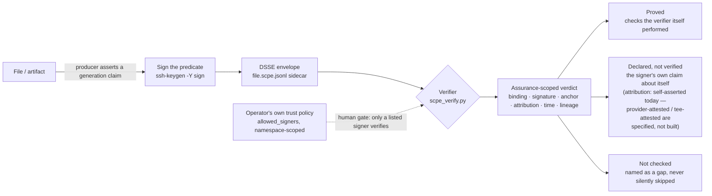

<p align="center"></p>

# SCPE — Signed Content Provenance Evidence

[](https://github.com/augbastos/scpe/actions/workflows/ci.yml)
[](https://pypi.org/project/scpe-protocol/)
[](pyproject.toml)
[](LICENSE)

**A signed, checkable claim about what produced a file — and a verifier that tells you
exactly what it checked and what it did not.**

```console
$ python reference/scpe_verify.py report.pdf --policy ~/.ssh/allowed_signers
[OK] ok

  What this result is:
    binding      bound
    signature    valid
    anchor       policy
    attribution  self-asserted  - the producer signed a claim about itself; nothing independent corroborates it
    time         unanchored
    lineage      declared

  Proved (checks this verifier performed):
    + subject digest matches the supplied bytes (sha256)
    + signature over the predicate by SHA256:Y6GIsYhCeRNdFc9wzAD/K4mv8FvFoQiG/ZvV3WOiGKc (principal alice, role-scoped namespace)
    + the signing key is listed in the operator's allowed_signers file

  Declared by the signer (NOT verified):
    ~ generation.digitalSourceType = http://c2pa.org/digitalsourcetype/trainedAlgorithmicData
    ~ generation.provider = anthropic
    ~ generation.model = claude-opus-4-5-20251101
    ~ generation.humanOversight = prompt_guided
    ~ subject[0].name = report.pdf
    ~ subject[0].mediaType = application/pdf
    ~ derivedFrom: inputTo quarterly.csv

  Not checked:
    ? that claude-opus-4-5-20251101 produced these bytes - the claim is signed by the producer about itself, and no provider or TEE attestation is present
    ? when this was signed - no verified time anchor is present
    ? that any derivation edge occurred - no parent statement was resolved
    ? that no other transformation occurred - SCPE cannot express that claim
```

*(Real output, pasted unedited. There is no `scpe verify` console script for this format —
the published `scpe` entry point still belongs to the retired `scpe/0.1` CLI.)*

**That last block is the product.** Most tools in this space answer with a verdict. This one
answers with the scope of the verdict.

---

## How it works



The signature is what binds the predicate to a signer (**B → C**). The human gate is the
**operator's own trust policy** — the `allowed_signers` file (format shown under
[Install and use](#install-and-use)), held offline, with no infrastructure: nothing
verifies for a key that isn't listed in it (**P → D**). There is no
GitHub identity binding and no repo-owner merge gate in this flow — that was `scpe/0.1`'s
pull-request model, retired; see [What came before](#what-came-before). What comes out
(**E**) is never collapsed into one verdict: it is six independently computed facets, split
into what the verifier proved, what the signer merely declared, and what nobody checked.

## What this is

SCPE is an [in-toto](https://github.com/in-toto/attestation) predicate type carried in a
[DSSE](https://github.com/secure-systems-lab/dsse) envelope, stored as a detached
`file.scpe.jsonl` sidecar, plus a single-file standard-library verifier.

It writes **no cryptography, no envelope, no canonicalization, no transparency log, no PKI,
and no AI-origin vocabulary.** All of that already exists and is better maintained elsewhere.
What SCPE adds is four things:

1. **A generation predicate** — *which model, at which version, from which provider, produced
   these bytes* — for the **in-toto/DSSE supply-chain stack**, which has no such predicate.
   C2PA 2.4 does say this, in `c2pa.ai-disclosure`, and says it well; it says it inside JUMBF,
   behind a certificate gate, in an ecosystem where 166 of 174 certified products are still on
   spec 2.2 and exactly one declares ML formats.
2. **Typed derivation edges** over arbitrary bytes, reusing C2PA's `parentOf` /
   `componentOf` / `inputTo` rather than minting a fourth vocabulary.
3. **Sidecar discovery** for a loose file — the convention in-toto never specified.
4. **An assurance model** that reports what a signature established as separate, computed
   facets — and never collapses them into a score, a grade, or a green tick.

## What this is not

- **Not an AI detector.** SCPE records a signer's assertion. Its truth rests entirely on the
  signer's honesty. Nothing here inspects bytes to guess whether a model wrote them.
- **Not proof that an AI created something.** `attribution: self-asserted` — the only value
  reachable for essentially every record today — means exactly one thing: *someone signed a
  claim about themselves.*
- **Not able to say a file is human-made.** SCPE inherits in-toto's monotonic-policy
  principle: attestations only add. "This is not AI-generated" is structurally
  inexpressible, permanently.
- **Absence of a record proves nothing.** A file without one either never had one or had it
  stripped. These are indistinguishable, and the verifier says so rather than implying
  suspicion.

---

## Why it exists

The honest case is narrow, and it starts by conceding what it is not.

Most of what a "provenance envelope for AI artifacts" would offer is **already shipped**.
`c2pa-rs` 0.26.46 (8 April 2026) made sidecar signing format-agnostic — *"Allow any file type
to be signed with a sidecar"* (PR #2014), confirmed in the SDK source; `c2patool` itself still
gates unknown extensions on a hardcoded MIME table, which is the only reason that seam is not
already closed at the CLI. in-toto has bound subjects purely by digest "regardless of content
type" since v1. OpenSSF Model
Signing v1.0 ships a detached, offline-verifiable sidecar for AI artifacts today.
`gh attestation verify --bundle --custom-trusted-root` does air-gapped verification as a
product feature. And "not an AI detector" is the incumbents' published position, stated
better than this project would state it. Everything in this section is as of the primary-source survey of **31 August 2026**
([docs/standards-landscape.md](docs/standards-landscape.md)); the in-toto registry had five
unmerged AI-predicate proposals open at that date, so these claims are dated, not permanent.

The survey found three surviving seams (plus a weaker fourth). Two of them are
what this project acts on:

**The supply-chain stack has no way to say "model M, version V, provider P produced these
bytes."** C2PA can — `c2pa.ai-disclosure` carries a model PURL, a scientific domain and a
human-oversight enum, and that clause of the thesis is genuinely occupied there. But nothing in
in-toto, SLSA or Sigstore can, and that is where software artifacts actually live: OpenSSF
Model Signing treats the model as the *subject* — a signed weights file — never as the *agent*
of another artifact's creation. That inversion is the gap. in-toto issue
[#244](https://github.com/in-toto/attestation/issues/244) asked this exact question in June
2023 and has been untouched since July 2023, while five AI-predicate proposals were filed
against that registry between May and August 2026 and none merged.

**Nobody renders what a signature actually established.** `cosign` says PASS or FAIL against a
policy you supplied. `gh attestation verify` says verified. C2PA comes closest — it reports a
richer validation result than a boolean, with a detailed status-code taxonomy — and it is
still one axis. Meanwhile the ordinary real case is
*"identity X signed a statement saying model M made these bytes, and M signed nothing"* — a
notarized claim about a third party — and no verifier in the field says that out loud.

Neither is a cryptographic contribution. This is a vocabulary and a verification-honesty
layer, and the project says so rather than dressing it up.

---

## Install and use

Requires Python 3.11+ and `ssh-keygen`. Nothing else — the verifier is one standard-library
file.

```console
# sign a file with a key you already have
$ python reference/scpe_sign.py report.pdf --key ~/.ssh/id_ed25519 \
      --provider anthropic --model claude-opus-4-5-20251101 \
      --source-type trainedAlgorithmicData --oversight prompt_guided
report.pdf.scpe.jsonl

# verify against a trust policy you control
$ python reference/scpe_verify.py report.pdf --policy ~/.ssh/allowed_signers
$ python reference/scpe_verify.py report.pdf --policy ~/.ssh/allowed_signers --json
```

The trust policy is OpenSSH's own `allowed_signers` format, used verbatim:

```
alice namespaces="scpe/1"     ssh-ed25519 AAAA…
bob   namespaces="scpe-obs/1" ssh-ed25519 AAAA…
```

That `namespaces=` restriction is enforced by OpenSSH itself at verification time, so a key
bound to `scpe/1` **verifies** as a producer and will not verify as an observer. Role separation is expressible in a
text file the operator owns, offline, with no infrastructure.

### Recording what a file came from

```console
$ python reference/scpe_sign.py final.txt --key ~/.ssh/id_ed25519 \
      --derived-from draft.txt:parentOf \
      --derived-from quarterly.csv:inputTo
```

A `parentOf` edge is pinned to the parent's signed statement, not merely to the parent file —
so someone who publishes their own record about the same input cannot silently become your
ancestor. The tool refuses to declare a `parentOf` edge to a file that has no record, because
that pin is not optional.

### Committing to a prompt without storing it

```console
$ python reference/scpe_sign.py report.pdf --key ~/.ssh/id_ed25519 \
      --commit-prompt ./prompt.txt
```

Prompts contain intellectual property, confidential material and personal data. **SCPE never
requires storing one.** A commitment records a salted, structurally framed hash (SD-JWT
disclosure form) — the prompt text never enters the record. The disclosure needed to open it
later is written beside you, to `report.pdf.scpe.disclosures.jsonl`, and **is never
published**: without it the commitment can never be opened, by anyone, including you.

---

## Exit codes

| Code | Status | Meaning |
|---|---|---|
| 0 | `ok` | Everything checked, checked out. |
| 10 | `ok-self-anchored` | Valid — but the trust anchor came from inside the input. |
| 11 | `subject-unavailable` | Record is valid; the artifact bytes were never supplied. |
| 20 | `signature-invalid` | A declared signature failed. |
| 21 | `digest-mismatch` | The supplied bytes are not the signed ones. |
| 22 | `assurance-overclaimed` | The producer asserted a facet the verifier recomputed differently. |
| 30–35 | `unsupported-*`, `malformed-*` | Fail closed on anything unrecognised. |
| 40 | `no-provenance-found` | No record located. |
| 50 | `tooling-error` | A backend was unavailable. **No check ran.** |

**Branch on `status`, never on an exit-code range.** 10 and 11 are passes in which the
verifier established very little.

---

## Honest status

**This project has no adopters, no users, and no external implementations.** It is a
specification and a reference implementation by one person, published so the ideas can be
checked and, if they hold up, filed upstream.

- The predicate type is **not** registered with in-toto. Filing it is the next step, not a
  completed one.
- No AI provider emits SCPE records. None has been asked.
- `attribution: provider-attested` and `tee-attested` are specified and **the reference
  verifier reaches neither** — it implements no C2PA, Sigstore or TEE-receipt importer. The
  design's one real path to `provider-attested` (reading an Anthropic-signed C2PA image as an
  input edge, [SPEC §15.2](spec/SPECIFICATION.md)) is designed and not built. No provider
  signs *text* output in a form a third party can verify offline.
- Interoperability with C2PA, Sigstore and SLSA is **designed and not implemented** — see
  [SPECIFICATION.md §15](spec/SPECIFICATION.md).
- The reference verifier implements four of five `anchor` values (`policy`, `flag`,
  `bundled`, `forge`). **`time: externally-anchored` is specified and emitted by no code
  here** — no time anchor is validated, so that facet always reads `unanchored`.
- There is **one** implementation. A second, written independently from the specification,
  is what would turn self-consistency into conformance.
- The `scpe` console script **published on PyPI today** is the retired `scpe/0.1` CLI and
  does **not** verify this format. This repository no longer defines that entry point —
  `scpe-verify` and `scpe-sign` replace it — but anyone who installed the old release still
  has the old tool. The Go and Rust ports of the retired format were removed rather than
  ported.

The ADR carries a
[pre-registered falsification test](docs/adr/0001-from-pull-requests-to-generation-events.md#pre-registered-falsification-test):
five external events, three of which would retire this project outright. One — in-toto merging
an AI-generation predicate first — is live.

### What came before

`scpe/0.1` was a signed envelope for **pull-request contributions**: it asked maintainers to
gate merges on whether an AI-assisted change carried a signed disclosure. That version is
retired, and the reason is worth keeping in view.

The argument did not survive contact with the maintainers it was built for — and the reason
is more interesting than "nobody cared."

**OpenSSL already automates the part that matters.** Their CLA service reads every non-trivial
commit for the `Assisted-by:` trailer, uses `Co-authored-by:` naming a known AI tool as a
backstop, and holds an AI-assisted commit from a contributor still on CLA 1.0 until they
re-sign. Asked whether the trailer's mere *presence* is checked for someone already on 1.1:
*"Obviously not and we don't enforce it."* They built enforcement where disclosure carried a
legal consequence and deliberately built none for transparency alone. That is not a project
failing to enforce its policy; it is a project enforcing the branch that routes somewhere.

**MicroPython checks by eye, and reports that it works.** *"I seldom find it is omitted"* —
the real failure being people circumventing the template, which a checkbox lint would not
catch — and *"Most authors quickly correct when reminded by a human, less so when CI is
showing ❌"*.

Both said no to **the mechanism this project was built on**: a CI gate on a disclosure
trailer. Neither said provenance does not matter.

The rewrite ([ADR 0001](docs/adr/0001-from-pull-requests-to-generation-events.md)) moves the
subject from a pull request to a file, and the question from *"was this contribution
disclosed?"* to *"what produced this file, and how much of that can anyone actually check?"*
Whether **that** buyer exists is not established either, and the ADR says so.

---

## Documents

| | |
|---|---|
| [spec/SPECIFICATION.md](spec/SPECIFICATION.md) | The protocol. Normative, RFC 2119 language. |
| [spec/THREAT_MODEL.md](spec/THREAT_MODEL.md) | What is defended, and what is not. |
| [docs/standards-landscape.md](docs/standards-landscape.md) | Primary-source survey: C2PA 2.4, in-toto, DSSE, SLSA, Sigstore, SCITT, OMS, the agent stack — including what this project believed and got wrong. |
| [docs/adr/0001](docs/adr/0001-from-pull-requests-to-generation-events.md) | Why the pivot, what was deleted, and the objection this project raised against itself. |
| [spec/test-vectors-v1/](spec/test-vectors-v1/) | The normative conformance corpus. |

## Security

The verifier performs **zero network I/O**. There is no code path in it that opens a socket.

Report vulnerabilities per [SECURITY.md](SECURITY.md).

## Licence

Specification: CC BY 4.0. Code: see [LICENSE](LICENSE).
